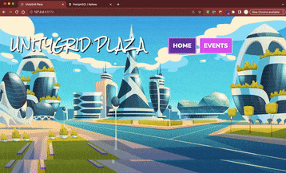

# WEB103 Project 3 - *UnityGrid Plaza*

Submitted by: **Yevheniya Solomyana**

About this web app: **creates a virtual community space with an interactive interface that allows users to explore events by location. The user is able to click on one of four locations and view events that have occurred or will occur there**

Time spent: **8** hours

## Required Features

The following **required** functionality is completed:

<!-- Make sure to check off completed functionality below -->

- [X] **The web app uses React to display data from the API**
- [X] **The web app is connected to a PostgreSQL database, with an appropriately structured Events table**
  - [X] **NOTE: Your GIF or a screenshot added to this README must include a view of your Railway database that shows the contents of the table used by your app**
- [X] **The web app displays the title of the app**
- [X] **A visual interface allows the user to select a Location they would like to view**
- [X] **Clicking on a Location shows a list of all items from the Events table that corresponds to that Location**
- [X] **Each Location detail page should have its own unique URL**

## Video Walkthrough

Here's a walkthrough of implemented required features:

<!-- Replace this with whatever GIF tool you used! -->
GIF created with Kap
<!-- Recommended tools:
[Kap](https://getkap.co/) for macOS
[ScreenToGif](https://www.screentogif.com/) for Windows
[peek](https://github.com/phw/peek) for Linux. -->

## License

Copyright [2023] [Yevheniya Solomyana]

Licensed under the Apache License, Version 2.0 (the "License"); you may not use this file except in compliance with the License. You may obtain a copy of the License at

> http://www.apache.org/licenses/LICENSE-2.0

Unless required by applicable law or agreed to in writing, software distributed under the License is distributed on an "AS IS" BASIS, WITHOUT WARRANTIES OR CONDITIONS OF ANY KIND, either express or implied. See the License for the specific language governing permissions and limitations under the License.
